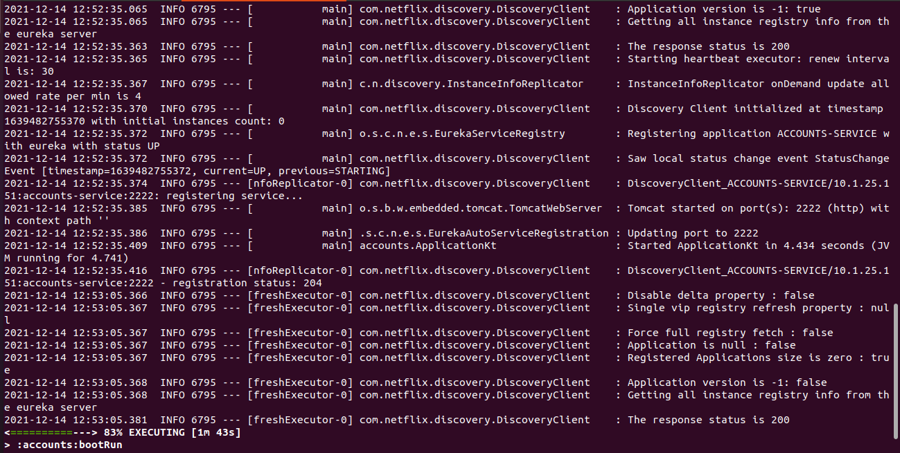
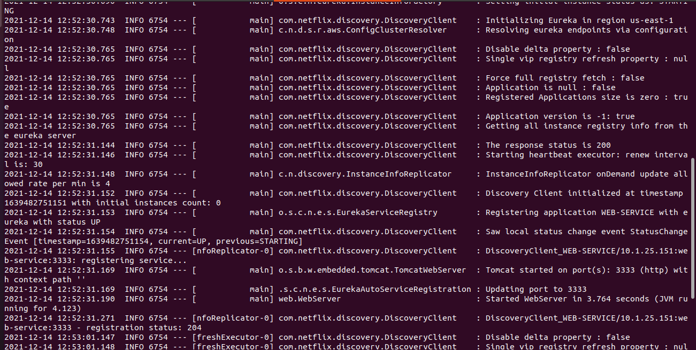
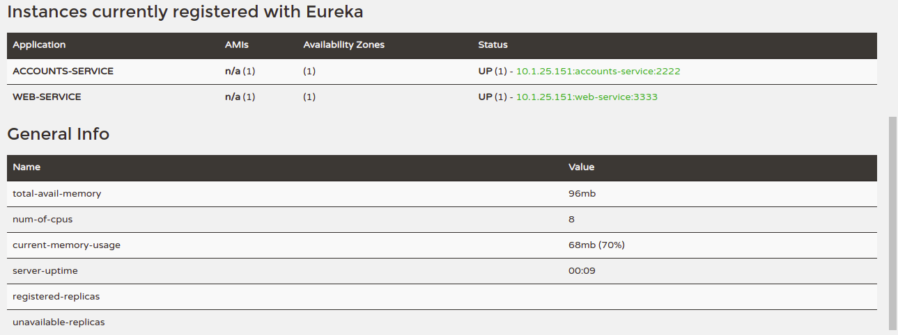
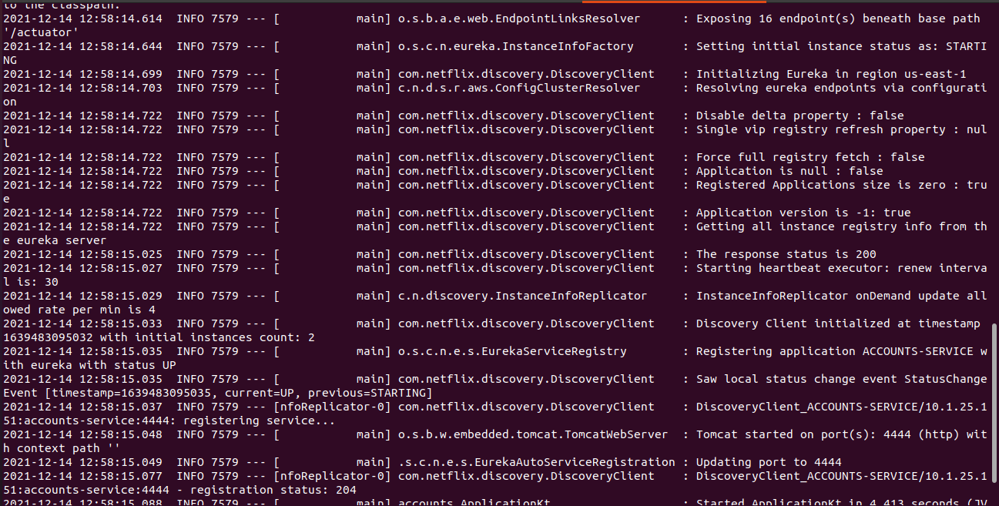
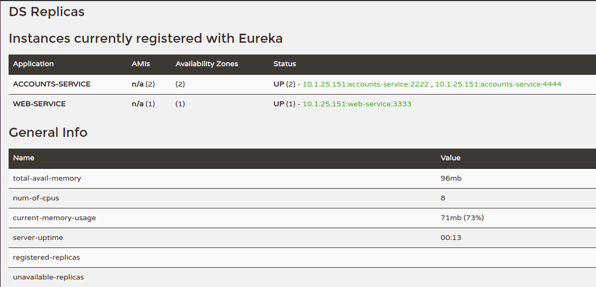
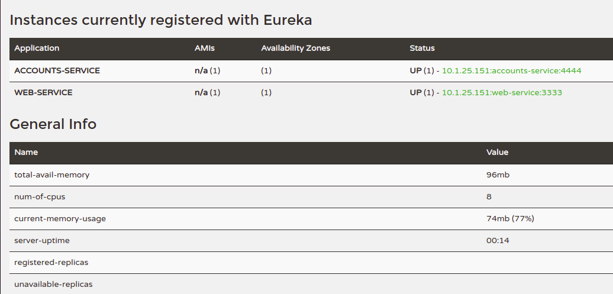
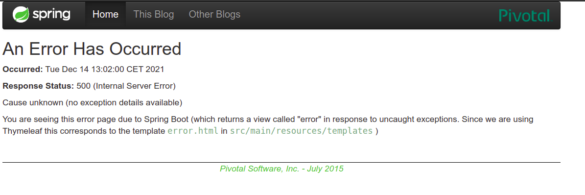
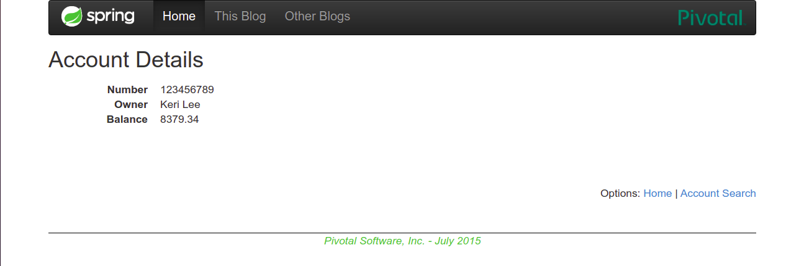

# Report
## The two services are running and registered
The registration service must be run before the other services. You can run all of the services by using the following commands:
```
./gradlew :registration:bootRun
./gradlew :accounts:bootRun
./gradlew :web:bootRun
```

When both accounts and web services start running they retgister into the Eureka service automatically.

###Logs
Accounts


Web



## The service registration service has two services registered
Once the services are running and registered you can access the Eureka dashborad in order to check their status:


## A second account service is running in the port 4444 and it is registered
In the `application.yml` file that can be found inside the `accounts/src/main/resources` folder stablishes the ports for the service. Changing the `port:2222` to `port:4444` allows a new accounts service to run on that port.


If we run a new accounts service the dashboard shows 2 `ACCOUNTS-SERVICE` running and registered.



## What happens when you kill the service with port 2222? Can the web service provide information about the accounts? Why?
Killing the service in 2222 makes it dissappears from the registration service and so it does from the Eureka Dashboard.



During a short period of time Eureka redirects to the dead service. If you ask for any information during that time the web service returns an Internal Server Error (500).
When you ask for an account after Eureka has detected the dead service it returns the user information without any problem.



It works because Eureka acts as a mediator between the web service and the accounts service. The web server asks for the `ACCOUNTS-SERVICE` and Eureka returns the route to it.

